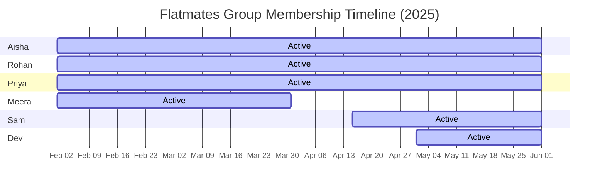

# Development Seed Dataset

This document details the development seed dataset loaded via [seed.js](file:///s:/Workplace/splitwise-clone-spreetail/server/prisma/seed.js). It is designed to verify temporal membership constraints, various split types, multi-currency features, and debt settlements.

---

## 1. Credentials

All demo users share the same password:
* **Password**: `Password123!`

| User Name | Email Address | Role/Status |
|-----------|---------------|-------------|
| **Aisha** | `aisha@example.com` | Group Creator / Active |
| **Rohan** | `rohan@example.com` | Active |
| **Priya** | `priya@example.com` | Active |
| **Meera** | `meera@example.com` | Joined and Left (Inactive) |
| **Sam**   | `sam@example.com`   | Joined later (Active) |
| **Dev**   | `dev@example.com`   | Joined latest (Active) |

---

## 2. Membership Timeline

The dataset focuses on the **Flatmates** group, using a temporal timeline spanning from February to May 2025:

* **Aisha, Rohan, Priya, Meera**: Joined on **2025-02-01**.
* **Meera**: Left on **2025-03-31**.
* **Sam**: Joined on **2025-04-15**.
* **Dev**: Joined on **2025-05-01**.

---

## 3. Sample Financial Data

### Expense 1: Groceries & Supplies (Equal Split)
* **Date**: 2025-02-15
* **Payer**: Aisha
* **Amount**: $120.00 USD
* **Split Type**: Equal split
* **Participants**: Aisha, Rohan, Priya, Meera (all active members at this date).
* **Breakdown**:
  * Aisha: owes $30.00
  * Rohan: owes $30.00
  * Priya: owes $30.00
  * Meera: owes $30.00

### Expense 2: Broadband Internet (Percentage Split)
* **Date**: 2025-03-10
* **Payer**: Rohan
* **Amount**: $200.00 USD
* **Split Type**: Percentage split
* **Participants**: Rohan (40%), Aisha (30%), Priya (30%).
* **Breakdown**:
  * Rohan: owes $80.00
  * Aisha: owes $60.00
  * Priya: owes $60.00

### Settlement: Rohan paid Aisha
* **Date**: 2025-03-15
* **Payer**: Rohan
* **Payee**: Aisha
* **Amount**: $50.00 USD

### Expense 3: Electricity Bill (Shares Split)
* **Date**: 2025-04-20
* **Payer**: Priya
* **Amount**: $100.00 USD
* **Split Type**: Shares split (e.g. occupancy-based shares)
* **Participants**: Priya (2 shares), Aisha (1 share), Sam (1 share). 
  * *Note: Meera is not included since she left on 2025-03-31. Dev is not included since he hasn't joined yet (joins 2025-05-01).*
* **Breakdown** (Total shares = 4; $25.00 per share):
  * Priya: owes $50.00 (2 shares)
  * Aisha: owes $25.00 (1 share)
  * Sam: owes $25.00 (1 share)

---

## 4. Net Balance Audit Log (Step-by-Step)

Here is how the balances update chronologically through the seeded transactions:

### Phase 1: After Groceries Expense (2025-02-15)
* Aisha paid $120.00, owes $30.00. Net change: **+$90.00**
* Rohan owes $30.00. Net change: **-$30.00**
* Priya owes $30.00. Net change: **-$30.00**
* Meera owes $30.00. Net change: **-$30.00**
* **Balances**: `Aisha: +$90.00` | `Rohan: -$30.00` | `Priya: -$30.00` | `Meera: -$30.00`

### Phase 2: After Broadband Internet (2025-03-10)
* Rohan paid $200.00, owes $80.00. Net change: **+$120.00**
* Aisha owes $60.00. Net change: **-$60.00**
* Priya owes $60.00. Net change: **-$60.00**
* **Balances**: `Aisha: +$30.00` | `Rohan: +$90.00` | `Priya: -$90.00` | `Meera: -$30.00`

### Phase 3: After Settlement (2025-03-15)
* Rohan pays Aisha $50.00. Rohan changes by **-$50.00**, Aisha changes by **+$50.00**
* **Balances**: `Aisha: +$80.00` | `Rohan: +$40.00` | `Priya: -$90.00` | `Meera: -$30.00`

### Phase 4: After Electricity Bill (2025-04-20)
* Priya paid $100.00, owes $50.00. Net change: **+$50.00**
* Aisha owes $25.00. Net change: **-$25.00**
* Sam owes $25.00. Net change: **-$25.00**
* **Final Balances**: 
  * **Aisha**: **+$55.00** (owes nothing, is owed $55.00)
  * **Rohan**: **+$40.00** (owes nothing, is owed $40.00)
  * **Priya**: **-$40.00** (owes $40.00 net)
  * **Meera**: **-$30.00** (owes $30.00 net; inactive)
  * **Sam**: **-$25.00** (owes $25.00 net)
  * **Dev**: **$0.00** (no transactions)
